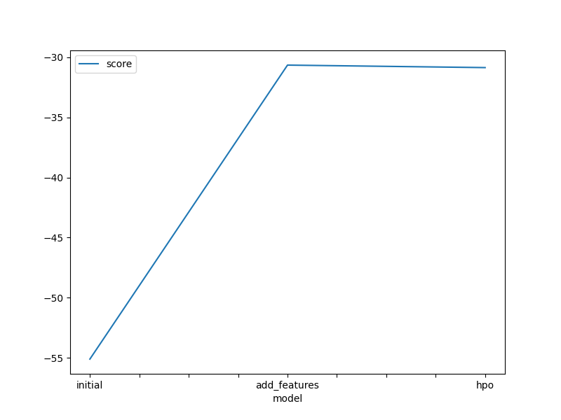
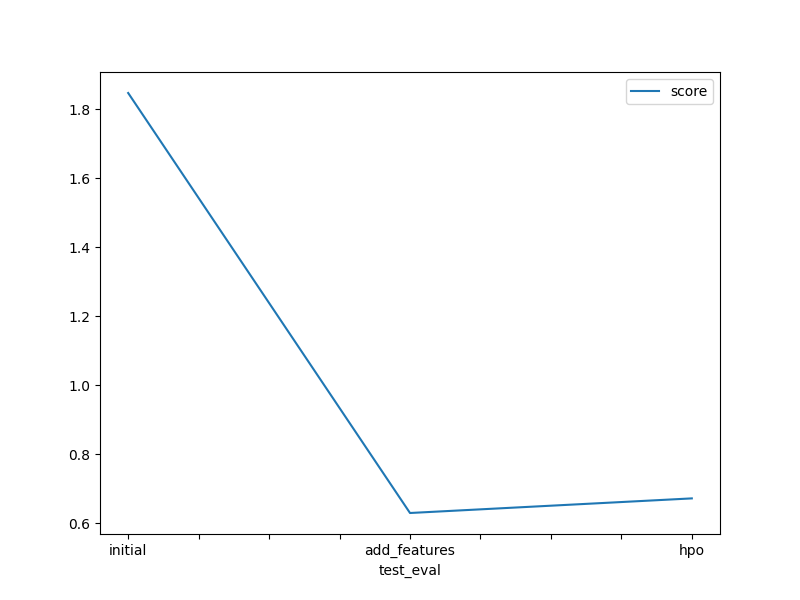

# Report: Predict Bike Sharing Demand with AutoGluon Solution
#### Chhalma Chhaya

## Initial Training
### What did you realize when you tried to submit your predictions? What changes were needed to the output of the predictor to submit your results?
When I first submitted my predictions, I realized that the evaluation metric (RMSLE) requires all predictions to be non-negative. However, the initial predictions from AutoGluon included some negative values, which are invalid for bike demand. I had to clip all negative predictions to zero before submission to meet the competition requirements.

### What was the top ranked model that performed?
The top-ranked model from the initial training was the WeightedEnsemble_L3 model.

## Exploratory data analysis and feature creation
### What did the exploratory analysis find and how did you add additional features?
During exploratory data analysis (EDA), I observed that:
Hour of the day significantly affects bike demand, with peaks during commuting hours (morning and evening). So, I extracted the hour from the datetime column.
Season and weather conditions also influence demand, so I treated them as categorical features for better handling by AutoGluon.
These newly engineered features helped the model better understand patterns related to time and weather conditions.

### How much better did your model preform after adding additional features and why do you think that is?
Without the additional features, the best model score was -55.109269. After adding features like hour, season, and weather, the model score improved to -30.652983. This improvement shows that the model better captured the underlying patterns in bike demand.

## Hyper parameter tuning
### How much better did your model preform after trying different hyper parameters?
When I added more features, the model performance significantly improved even though I trained for only 10 minutes. However, during hyperparameter tuning, the improvement was minimal. This could be because the tuning was constrained to a short training time (10 minutes), and more time or deeper tuning would likely result in better performance.

### If you were given more time with this dataset, where do you think you would spend more time?
If given more time, I would:

Increase the model training time for better performance,

Perform deeper and broader hyperparameter tuning,

Engineer more features (e.g., holiday indicators, working day effects),

Try different AutoGluon presets or even other libraries for comparison.

### Create a table with the models you ran, the hyperparameters modified, and the kaggle score.
| Model        | HPO 1          | HPO 2            | HPO 3                | Score   |
| ------------ | -------------- | ---------------- | -------------------- | -----   |
| Initial      | dropped casual | dropped register | -                    | 1.84725 |
| Add Features | added hour     | added season     | added weather        | 0.62907 |
| HPO          | searcher=random| num_trials=3     | num_stack_levels=1   | 0.67144 |
 
### Create a line plot showing the top model score for the three (or more) training runs during the project.

### Create a line plot showing the top kaggle score for the three (or more) prediction submissions during the project.

## Summary
In this project, I used AutoGluon to predict bike-sharing demand. The initial model provided a baseline, but performance improved significantly after feature engineering. Adding time-based (hour) and environmental (season, weather) features helped the model capture real-world patterns. While hyperparameter tuning led to minor gains, the limited training time constrained its effectiveness.

With more time and resources, further improvements could be achieved through extended training, better tuning, and additional feature engineering. This project highlighted the strong impact of thoughtful features and the automation power of AutoGluon for structured data problems.
